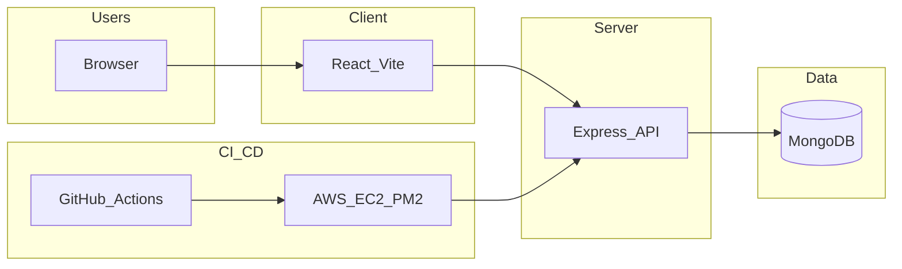

# Fatafat Chai

**Fast, authentic chai — from cart to cup.** A tea e-commerce style monorepo with a React (Vite) storefront, Express + MongoDB API, automated tests, and optional EC2 + PM2 deployment.

[](https://github.com/Gautam-Bharadwaj/FATAFAT-CHAI/actions/workflows/ci.yml)


## Architecture



| Layer | Responsibility |
|--------|------------------|
| **React (Vite)** | Product browsing, auth UI, cart, checkout flow; talks to the API via `fetch` (dev proxy `/api` → port 5000). |
| **Express** | REST API: products, auth (JWT), cart; validation and authorization middleware. |
| **MongoDB** | Persistent users, products, and per-user cart lines. |
| **GitHub Actions** | Lint, test, and (after green CI on `main`) SSH deploy to EC2. |
| **EC2 + PM2** | Runs `server/server.js` under PM2; static client build can be served by Nginx or any static host. |

## Workflow (development to production)

1. Develop locally in `client/` and `server/` (feature branches).
2. Open a pull request to `main`; **Lint** and **CI** workflows run (ESLint, Prettier, Jest).
3. Merge to `main`; **CI** runs on the push.
4. When **CI** completes successfully, **Deploy** runs: SSH to EC2, `git pull`, `npm ci`, build client, `pm2 restart fatafat-api`.

See [EC2_SETUP.md](EC2_SETUP.md) for one-time server provisioning and GitHub Secrets.

## GitHub Actions workflows

| Workflow | Trigger | What it does |
|----------|---------|----------------|
| **CI** (`ci.yml`) | Push to any branch; PRs to `main` | Backend: `npm ci`, ESLint, Prettier, Jest + coverage. Frontend: `npm ci`, ESLint, Prettier, Jest. |
| **Lint** (`lint.yml`) | Pull requests to `main` only | ESLint `--max-warnings 0` and Prettier `--check` for `server/` and `client/`. |
| **Deploy** (`deploy.yml`) | After **CI** succeeds on `main` (`workflow_run`) | SSH deploy: pull, install, build client, PM2 restart `fatafat-api`. |

`Deploy` cannot `needs:` jobs from another workflow file; gating is implemented with `workflow_run` on the **CI** workflow name.

## Design decisions

| Choice | Why |
|--------|-----|
| **React** | Component reuse (cards, cart lines, navbar), large ecosystem, straightforward testing with Testing Library. |
| **Express** | Small surface area, flexible routing, easy to test with Supertest. |
| **MongoDB + Mongoose** | Flexible schema for a evolving product catalog and embedded cart lines on users. |
| **PM2** | Keeps the API alive, restarts on crash, integrates cleanly with simple EC2 setups. |
| **Jest + Cypress** | Jest isolates units and integration against an in-memory DB; Cypress validates real browser flows. |

## Challenges and solutions

| Challenge | Solution |
|-----------|----------|
| **Cart state vs. logged-in user** | Cart is stored server-side on the `User` document; the client refetches after mutations and the navbar shows a count from `GET /api/cart`. |
| **Product images / static assets** | Product `image` fields store URL paths; Vite serves `public/` assets in dev and bundles client paths in production builds. |
| **JWT configuration in tests** | `JWT_SECRET` is read at **verify/sign time** so integration tests can set `process.env.JWT_SECRET` before issuing tokens. |
| **CORS / API base URL** | Dev uses Vite `proxy` to `localhost:5000`. Production can set `VITE_API_URL` at build time via `define` in `vite.config.js`. |

## Project structure

```
.
├── client/                 # Vite + React SPA
│   ├── src/
│   │   ├── components/     # Navbar, ProductCard, CartItem, Layout
│   │   ├── context/        # Auth + cart refresh
│   │   ├── pages/          # Home, Login, Products, Product detail, Cart, Checkout
│   │   ├── api/            # fetch helpers
│   │   └── __tests__/      # Jest + Testing Library
│   ├── vite.config.js
│   └── package.json
├── server/                 # Express API
│   ├── controllers/
│   ├── models/
│   ├── routes/
│   ├── middleware/
│   ├── utils/
│   ├── __tests__/          # Unit + integration (mongodb-memory-server)
│   ├── seed.js
│   ├── server.js
│   └── package.json
├── cypress/                # E2E specs, fixtures, support
├── scripts/                # setup, seed, health-check, deploy, dev
├── .github/workflows/      # CI, Lint, Deploy
├── docker-compose.yml
├── EC2_SETUP.md
└── README.md
```

## How to run locally

### Prerequisites

- Node.js **18+**
- MongoDB reachable at `MONGO_URI` (local or Atlas)
- Optional: `pm2` for production-like process management

### Setup

```bash
git clone <your-repo-url> fatafat-chai
cd fatafat-chai
chmod +x scripts/*.sh
bash scripts/setup.sh
```

Edit `server/.env` (created from `server/.env.example` if missing).

### Seed sample products

```bash
bash scripts/seed.sh
```

Inserts ten sample products when the `products` collection is empty.

### Start development

```bash
bash scripts/dev.sh
```

- Client: [http://localhost:3000](http://localhost:3000)
- API: [http://localhost:5000](http://localhost:5000)

Alternatively:

```bash
npm run dev --prefix server
npm run dev --prefix client
```

### Tests

```bash
npm test --prefix server -- --runInBand
npm test --prefix client
```

### E2E (Cypress)

Requires API + Mongo + seeded products and the client dev server:

```bash
# terminal 1
npm run dev --prefix server

# terminal 2
npm run dev --prefix client

# terminal 3
npm run cypress:open    # or npm run cypress:run
```

### Health check

```bash
bash scripts/health-check.sh
```

## Environment variables

### `server/.env`

| Variable | Description | Example |
|----------|-------------|---------|
| `PORT` | HTTP port for Express | `5000` |
| `MONGO_URI` | MongoDB connection string | `mongodb://localhost:27017/fatafat-chai` |
| `JWT_SECRET` | Secret for signing JWTs | long random string |
| `JWT_EXPIRES_IN` | Token lifetime | `7d` |

### `client/.env`

| Variable | Description | Example |
|----------|-------------|---------|
| `VITE_API_URL` | Absolute API origin for production builds (empty = same-origin / dev proxy) | `https://api.example.com` |

## API endpoints

| Method | Path | Auth | Description |
|--------|------|------|-------------|
| GET | `/api/health` | — | Liveness / status JSON |
| GET | `/api/products` | — | List products |
| GET | `/api/products/:id` | — | Product by id |
| POST | `/api/products` | Admin JWT | Create product |
| DELETE | `/api/products/:id` | Admin JWT | Delete product |
| POST | `/api/auth/register` | — | Register; returns JWT |
| POST | `/api/auth/login` | — | Login; returns JWT |
| GET | `/api/cart` | User JWT | Current cart with line totals |
| POST | `/api/cart` | User JWT | Body: `{ productId, quantity? }` add/update line |
| PATCH | `/api/cart/:itemId` | User JWT | Body: `{ quantity }` |
| DELETE | `/api/cart/:itemId` | User JWT | Remove line (by cart line id or product id) |

## Testing

| Type | Command | Notes |
|------|---------|--------|
| **Backend unit** | `npm run test:unit --prefix server` | Mocks Mongoose models where needed |
| **Backend integration** | `npm run test:integration --prefix server` | Jest + Supertest + `mongodb-memory-server` |
| **Frontend unit** | `npm test --prefix client` | Jest + jsdom + Testing Library |
| **E2E** | `npm run cypress:run` | Requires running stack; see [cypress/fixtures/user.json](cypress/fixtures/user.json) |

## License

This project's automation logic and infrastructure scripts are **Proprietary**. Unauthorised use or deployment of this configuration is strictly prohibited. For permissions, contact the author. See [LICENSE.txt](LICENSE.txt) for details.
